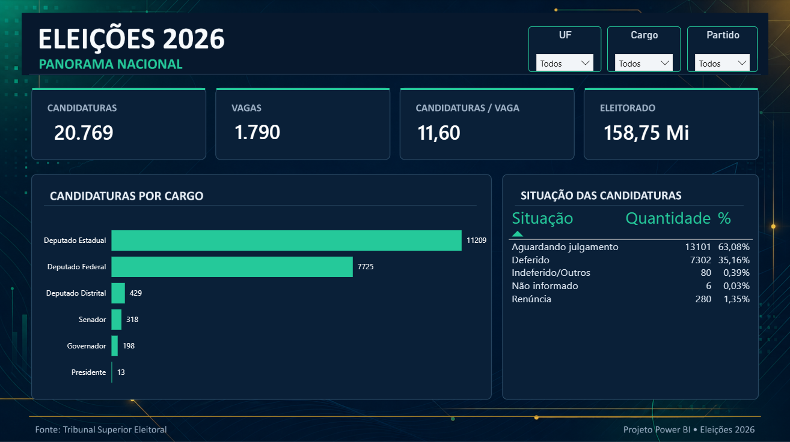
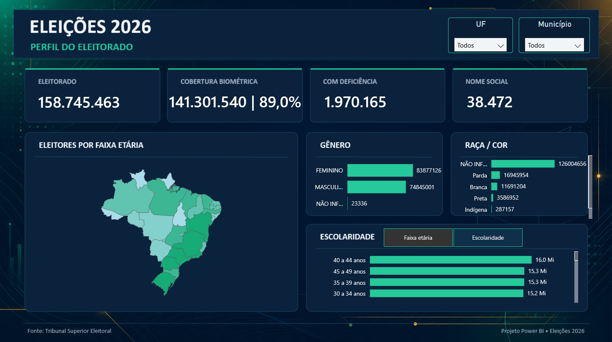
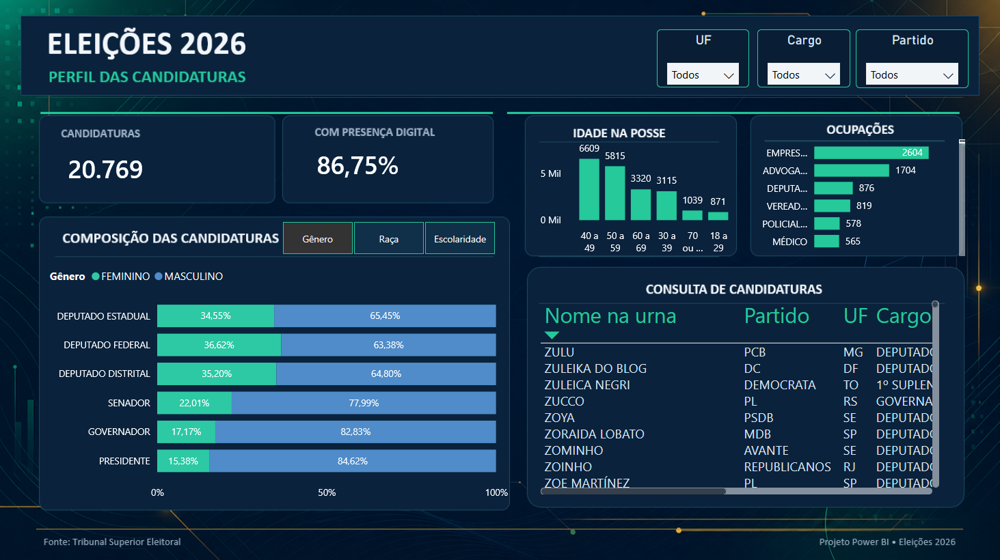
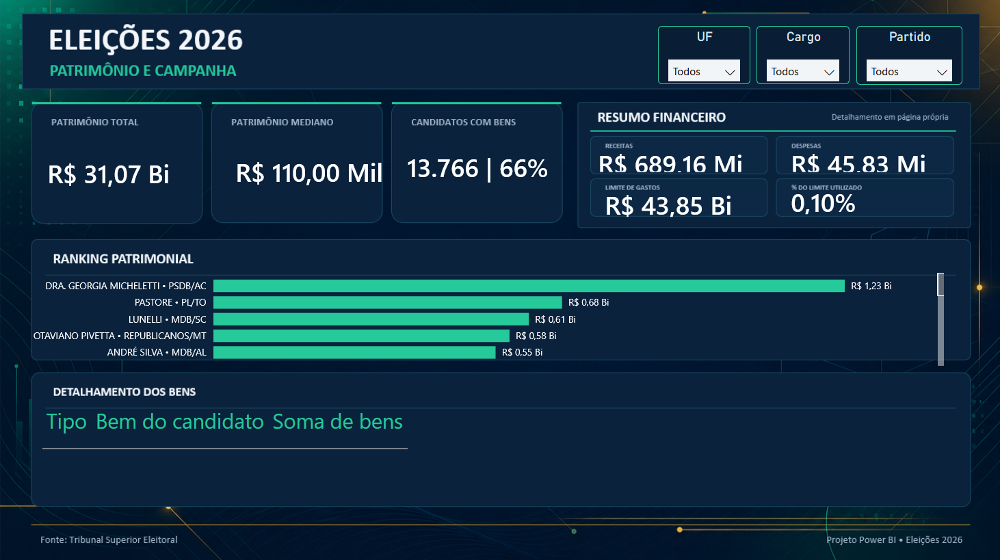
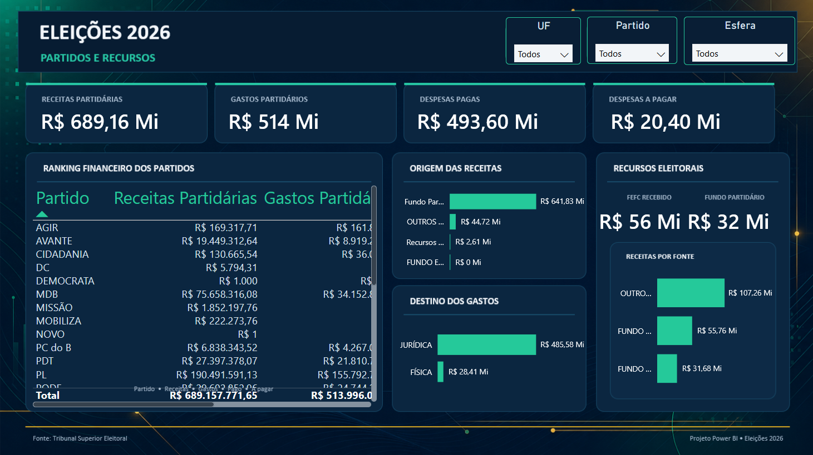
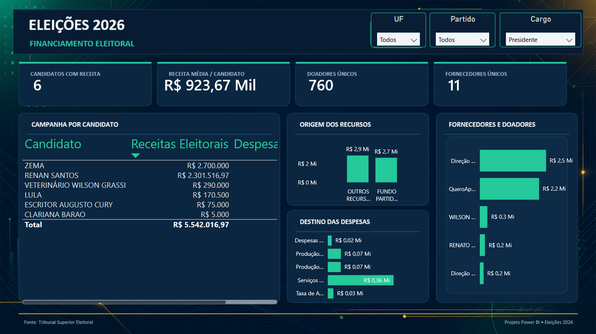

# Brazil Elections 2026 — Power BI

**English** | [Português (Brasil)](README.pt-BR.md)

> **One of the earliest publicly documented Power BI projects integrating TSE open data for Brazil's 2026 elections.**

This interactive project transforms official open data from Brazil's Superior Electoral Court (TSE) into six connected analytical views covering candidacies, the electorate, declared assets, political parties and campaign financing.

## Power BI file

[Download the updated nine-page report](pos-primeiro-turno/Eleicoes-2026-Pos-Primeiro-Turno.pbix): the original six pages plus elected candidates, party-quota seats (QP), first-round voting and turnout. The new pages use a snapshot extracted on October 5, 2026; the original pages retain their previous data.

The snapshot contains 1,287 proportional candidates classified as elected by QP and 285 by average. QP means *quociente partidário* (party quota), not QE (*quociente eleitoral*, electoral quota). This classification alone does not identify which candidate “pulled” another into office. See the [update guide](pos-primeiro-turno/LEIA-ME-FINAL.md) for scope, validation and refresh paths. The update includes PBIP sources and curated CSV tables; local Power BI caches are excluded.

[Download or open the Power BI project (`2026tse_dados.pbix`)](2026tse_dados.pbix). Power BI Desktop is required to edit the report.


## Project overview

The project turns multiple TSE datasets into a single analytical model designed to answer questions such as:

- How many candidacies are registered for each office and state?
- What is the demographic profile of voters and candidates?
- How are candidacies distributed by gender, race, education and occupation?
- How much wealth was declared by candidates?
- How much did parties receive and spend?
- Where do campaign resources come from and where are they spent?

The data is provisional and changes as the TSE processes registrations and electoral accounts. Figures shown in the screenshots represent a specific extraction and may differ from the latest official totals.

## Dashboard pages

### 1. National overview

Key election indicators, candidacies by office and registration status.



### 2. Electorate profile

Electorate, biometric coverage, voters with disabilities, social name usage and demographic distributions by state and municipality.



### 3. Candidate profile

Candidate composition by gender, race and education, as well as age, occupation, digital presence and an individual candidate lookup.



### 4. Assets and campaign

Declared assets, median wealth, candidates with asset declarations, a top-candidate ranking and an initial campaign-finance summary.



### 5. Parties and resources

Party revenue and expenses, financial ranking, sources of funds, expense destination and electoral-resource composition.



### 6. Electoral financing

Campaign revenue, average revenue per candidate, unique donors and suppliers, resource origin and expense destination.



## Data sources

All election data comes from the [TSE Open Data Portal](https://dadosabertos.tse.jus.br/), including:

- Candidates and complementary candidate information;
- Candidate declared assets;
- Coalitions, federations and available offices;
- Candidate social networks;
- Electorate profile and locality data;
- Annual party revenue and expenses;
- Candidate campaign revenue and contracted/paid expenses.

See [docs/DATA_SOURCES.md](docs/DATA_SOURCES.md) for the dataset map and refresh notes.

## Data pipeline

```text
TSE Open Data (ZIP/CSV)
          ↓
Automated download and extraction
          ↓
Python preprocessing for high-volume electorate files
          ↓
Power Query cleaning and standardization
          ↓
Power BI semantic model, DAX measures and relationships
          ↓
Interactive report
```

The electorate source was pre-aggregated into analysis-ready CSV files to reduce model size while preserving the dimensions used by the report. Technical identifiers are used for relationships; sensitive fields such as CPF and e-mail are not included in the analytical model or this repository.

## Main technologies

- Microsoft Power BI Desktop
- Power Query (M)
- DAX
- Python and pandas for preprocessing
- PowerShell and Python for data-refresh automation
- TSE open data in CSV format

## Repository structure

```text
eleicoes-2026-powerbi/
├── assets/
│   └── screenshots/
├── docs/
│   ├── DATA_SOURCES.md
│   └── METHODOLOGY.md
├── 2026tse_dados.pbix
├── .gitignore
├── LICENSE
├── README.md
└── README.pt-BR.md
```

Raw TSE files are intentionally excluded from version control because of size, update frequency and repository hygiene. The complete `.pbix` project is included for download and inspection in Power BI Desktop.

## Methodological notes

- Candidacy data is provisional and can change after judgments, appeals, withdrawals and substitutions.
- Electoral-account data is partial during the campaign and becomes more complete over time.
- “Not informed” is retained when its omission could distort demographic interpretation.
- Asset values are self-declared by candidates and should not be interpreted as independently audited net worth.
- Party accounts and electoral campaign accounts are separate datasets and are not treated as equivalent.
- Monetary indicators are displayed in Brazilian reais (BRL).

More detail is available in [docs/METHODOLOGY.md](docs/METHODOLOGY.md).

## Author

Developed by **Pedro Zampier** as a data analytics and Power BI portfolio project.

Data source: [Tribunal Superior Eleitoral — Portal de Dados Abertos](https://dadosabertos.tse.jus.br/).

## License

The repository documentation and original project materials are available under the [MIT License](LICENSE). TSE data remains subject to its official terms and applicable Brazilian law.
